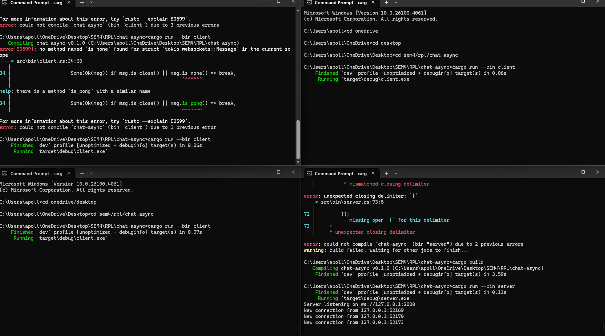
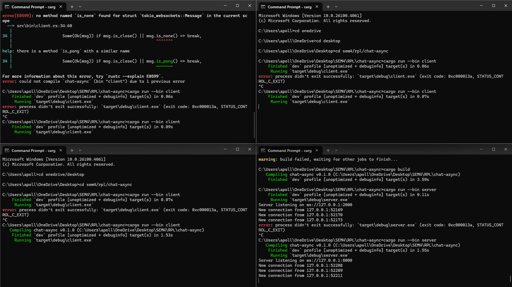
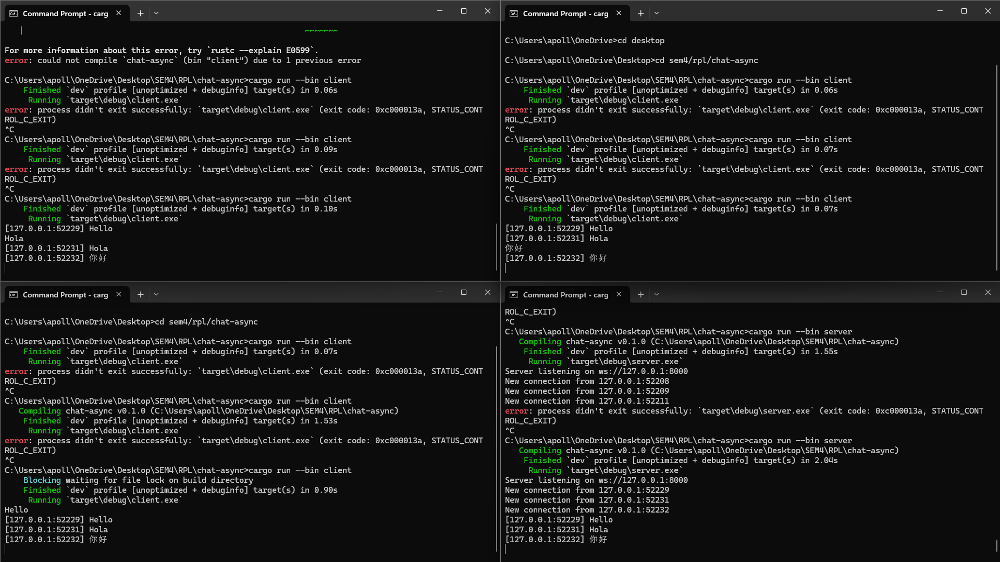

# Chat Async — Broadcast Chat Experiments

This project demonstrates a broadcast chat system using Rust's asynchronous programming model with `tokio` and `tokio-websockets`. It includes a WebSocket server and multiple clients communicating concurrently.

---

## Experiment 2.1: Original Code and How It Runs

- Created `server.rs` and `client.rs` under `src/bin/`.
- Implemented asynchronous WebSocket communication using `tokio-websockets`.
- Used `tokio::select!` in both server and client to concurrently:
  - Receive messages from the stream.
  - Broadcast/print messages.

### Screenshot:


### Observation:
Messages sent by one client are successfully received by all others. The server logs each client connection and forwards messages correctly.

---

## Experiment 2.2: Modifying the WebSocket Port

- Changed the WebSocket port used by both server and client from `2000` to `8080`.
- Required updates in:
  - `TcpListener::bind(...)` in `server.rs`
  - `ClientBuilder::from_uri(...)` in `client.rs`

### Screenshot:


###  Observation:
The system runs successfully on the new port. Ensuring consistent port configuration between server and client is critical for proper WebSocket connection.

## Experiment 2.3: Add IP and Port Info to Broadcasted Messages

- Modified the server to include the sender's IP and port in each broadcasted message.
- Used Rust's `SocketAddr` from the TCP listener to format the prefix:
  ```rust
  let full_msg = format!("[{addr}] {text}");

### Screenshot:


### Observation:
Since we don’t have a username or client ID system yet, the IP and port are useful to distinguish between clients. This is especially important in a multi-client chat scenario to track who is speaking.

This approach simulates a basic identity system, which is essential in real-world messaging platforms where identifying message origins is crucial for context, moderation, and reliability.